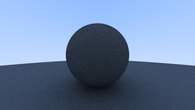
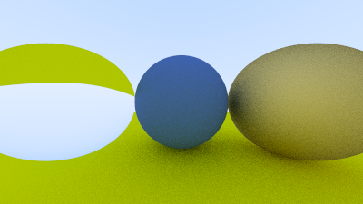
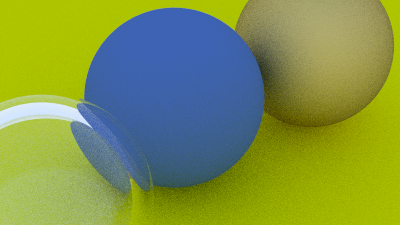
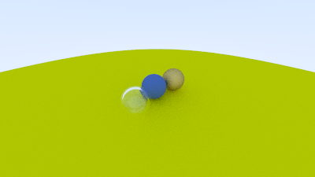
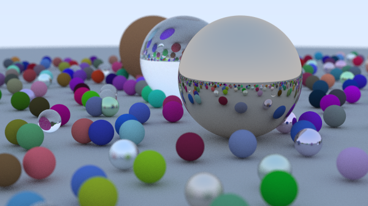

# RayTracing Project

## Overview

Ray tracing is a technique for rendering realistic images by simulating the way light interacts with objects in a scene. 

In this project, a basic ray tracing engine was developed. It renders simple 3D scenes based on the ray-sphere intersections and camera's location. It has features such as:


- **Ray-Sphere Intersection**: The ray tracer computes if and where a ray intersects a sphere.
- **Antialiasing**: Multiple samples are taken per pixel to produce a smooth image without jagged edges.
- **Lambertian Diffuse Material**: Simulates how rays bounce randomly from diffuse surfaces.
- **Camera System**: A camera is set up to cast rays through the scene, with the ability to control field of view (FoV), aspect ratio, and resolution.


- **Recursive Ray Bounces**: The ray tracer supports up to a specified depth of recursive bounces for realistic light diffusion.
- **Gamma Correction**: The output image is gamma-corrected for accurate brightness.

### Features Explained

1. **Rendering Spheres**:
   - Spheres are the primary geometric object used in this project. The algorithm calculates whether a ray intersects with a sphere, which is key to determining where the ray hits the object and how light reflects or refracts from that point.

2. **Antialiasing**:
   - Antialiasing smooths the jagged edges of rendered objects by averaging colors from multiple rays per pixel, producing smoother transitions between different colors. This prevents the visual artifacts known as "aliasing," where sharp edges can look unnatural.
2. **Basic Shading**:
   - The project supports three types of materials for shading objects:
     - **Lambertian Reflection (Diffuse surfaces)**: Simulates rough, matte surfaces where light scatters in many directions.
     - **Metal Reflection**: Mimics smooth, reflective materials like metal, where light reflects in a specific direction.
     - **Dielectric (Transparent surfaces)**: Models transparent materials such as glass or water, where light bends (refracts) as it passes through the object.

3. **Camera Simulation**:
   - The camera is modeled with adjustable parameters, allowing you to simulate realistic camera effects such as field of view, focus, and depth of field. This adds realism by allowing objects at different distances to appear blurred or sharp, just as in a real photograph.


## Build Instructions

Follow the steps below to build the project:


1. **Configure the Build**

    Use CMake to configure the build system. 

    ```bash
    cmake -B build
    ```

2. **Build the Project**

    After configuring the build, compile the project: 

    ```bash
    cmake --build build
    ```

    This will generate the executables in the `build` directory.

3. **Run `raytraced_image_v2` to produce `ppm` picture format:**

    ```bash
    build/raytraced_image_v2 > vector_diagram/raytraced_xxx.ppm
    ```

## Project Structure

- `main.cpp`: Main entry point of the project. Handles ray tracing logic and rendering loops.
- `hittable.h` and `sphere.h`: Defines the geometric objects in the scene, such as spheres.
- `vec3.h`: A utility class for 3D vector operations.
- `camera.h`: Implements a simple camera model with configurable parameters like field of view and aperture.
- `material.h`: Contains shading models to simulate various material properties.


## Ray-Sphere Intersection

In ray tracing, determining if and where a ray intersects a sphere is crucial. The equation for a sphere of radius `r` centered at a point `C` is:

```math
(C - P) \cdot (C - P) = r^2
```

To find out if a ray `P(t) = Q + t * d` intersects the sphere, we substitute `P(t)` into the sphere equation:

```math
(C - (Q + t \cdot d)) \cdot (C - (Q + t \cdot d)) = r^2
```

This expands and simplifies to a quadratic equation in `t`:

```math
t^2 \cdot (d \cdot d) - 2t \cdot (d \cdot (C - Q)) + ((C - Q) \cdot (C - Q) - r^2) = 0
```

Solving this quadratic equation gives:

- `a = d ⋅ d`
- `b = -2 * (d ⋅ (C - Q))`
- `c = (C - Q) ⋅ (C - Q) - r^2`

Using the quadratic formula, we can solve for `t`:

```math
t = {-b \pm \sqrt{b^2 - 4ac}}/{2a}
```

The discriminant `b^2 - 4ac` determines whether the ray intersects the sphere:

- **Positive**: Two intersection points (the ray hits the sphere twice).
- **Zero**: One intersection point (the ray grazes the sphere).
- **Negative**: No intersection (the ray misses the sphere).

This geometric interpretation directly relates to the algebra, making it an essential concept in ray tracing.

## Results

### 1. Camera Gradient

- **Description**: This image demonstrates the camera setup in the scene by rendering a color gradient. The gradient shows how rays cast from the camera are distributed across the image, which helps visualize how the camera interacts with the scene.

### 2. Diffusing Lambertian Spheres

- **Description**: This rendering shows multiple spheres with **Lambertian (diffuse) surfaces**. Lambertian materials scatter light uniformly in all directions, leading to a soft, matte appearance.

### 3. Glass Refraction

- **Description**: This image depicts a transparent object with **dielectric material properties**, mimicking the behavior of glass. The refraction and reflection effects show how light bends as it passes through or reflects off the object.

### 4. Zoomed In View

- **Description**: A close-up view of the scene to demonstrate how the camera can zoom in on objects, creating a tighter field of view. This image shows finer details of the rendered objects.

### 5. Distant View

- **Description**: This image is taken from a distant camera view, showing the entire scene with a wider field of view. The objects appear smaller and the overall composition of the scene is visible.


### 6. Final Render - Glass and Metal Objects

- **Description**: This is the final output of the ray tracing engine. It combines multiple features, including diffusing materials, reflections, refractions, and antialiasing. 
The metal object reflects light, while the glass object refracts light, showing the difference between reflective and transparent materials.


## Conclusion

The primary challenge solved in this project was building a fully functional ray tracing engine from the ground up, without relying on any existing rendering frameworks. This required a deep understanding of the physics of light, mathematical calculations for ray-object intersections, and implementing key components such as shading, camera simulation, and output rendering. By building everything from scratch, I addressed the problem of creating a minimal, yet effective, ray tracing engine that can generate simple 3D scenes with realistic lighting and materials.

This approach allowed for:
- Complete control over the rendering pipeline.
- Understanding the core principles of ray tracing, from geometric calculations to image rendering.
- Optimizing the implementation for performance and flexibility, making it easier to expand with new features in the future.